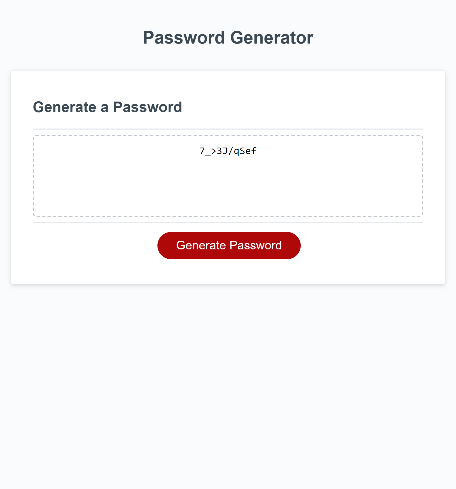

# Password Generator

## Description

This project I was creating a password generator in order to generate a randomly assigned password. My motivation for this project was in order to further my skills in javascript and make a functioning password generator. I learned a lot about how to properly scope variables and functions together so they are read correctly. This solves the problem of creating a new passwords for sites that I may need one for.

## Installation

N/a

## Usage

[Link to the generator](https://sofuto22.github.io/password-generator)

## Credits

N/a

